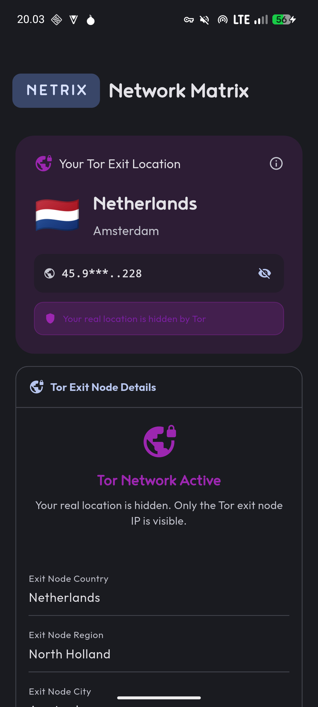
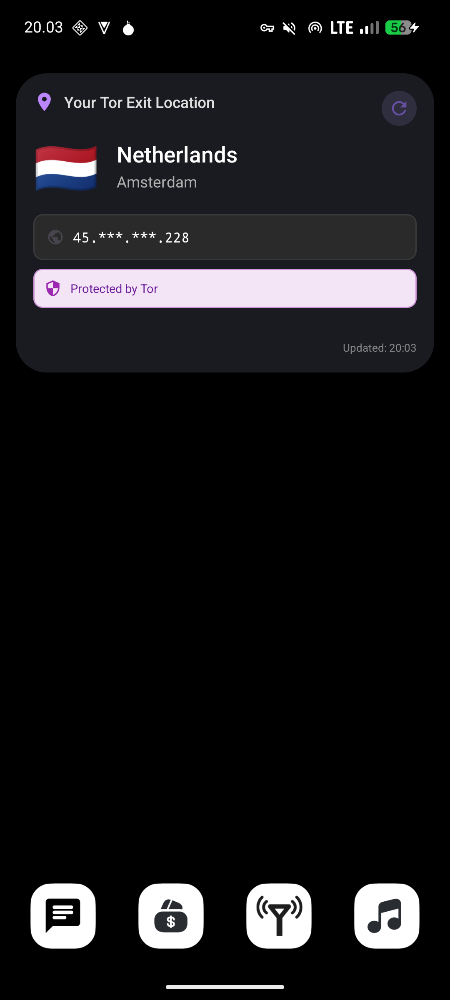

# Netrix - Network Matrix

A Flutter application for network information and privacy assessment.

## Features

- Public IP detection and geolocation
- VPN and Tor network detection
- Local network interface information
- Privacy assessment and leak detection
- Customizable IP lookup providers

## Screenshots

<div style="display: flex; justify-content: space-around; gap: 10px;">
  
  
  
</div>


## Privacy

All data is processed locally on your device. No information is sent to our servers. The app uses third-party IP lookup services to gather network information.

## Installation

### Prerequisites
- Flutter SDK 3.0+
- Dart 2.17+

### Dependencies
```yaml
dependencies:
  flutter:
    sdk: flutter
  http: ^1.1.0
  shared_preferences: ^2.2.2
```

### Setup

```bash
git clone https://github.com/yourusername/netrix.git
cd netrix
flutter pub get
flutter run
```

### Build

```bash
# Android
flutter build apk --release

# iOS
flutter build ios --release

# Web
flutter build web --release
```

## Usage

Launch the app to automatically check your network status. Pull down to refresh or use the refresh button. Access provider settings to add custom IP lookup services.

## Technical Details

### Architecture
- State Management: StatefulWidget with AutomaticKeepAliveClientMixin
- Network Layer: HTTP package
- Local Storage: SharedPreferences
- UI: Material Design 3

## Detection Methods

### VPN Detection
- ISP and organization name analysis
- Pattern matching for known VPN providers
- Hosting provider identification
- ASN validation

### Tor Detection
- Organization name checking
- Tor Project API validation
- Third-party service verification
- Known Tor ASN database

## Contributing

Contributions welcome. Fork the repository, create a feature branch, commit changes, and open a pull request.

Follow [Effective Dart](https://dart.dev/guides/language/effective-dart) guidelines.


## Acknowledgments

Flutter team and the open-source community.
